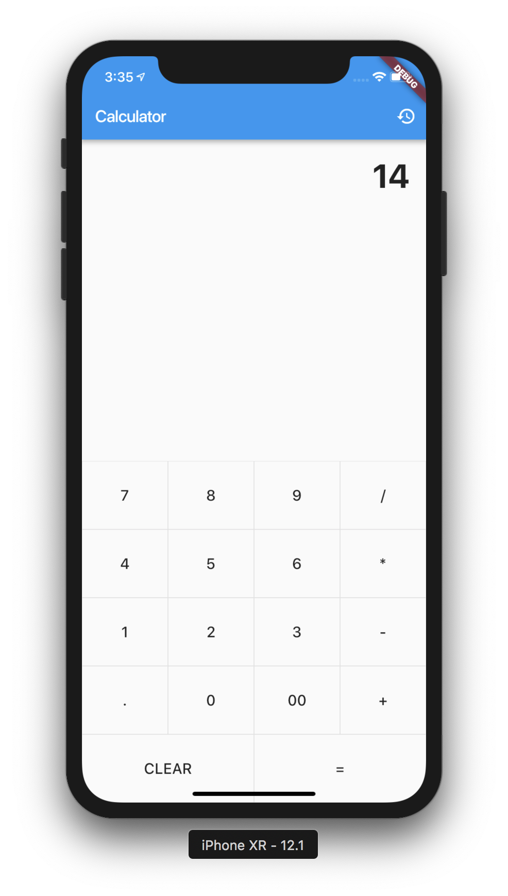
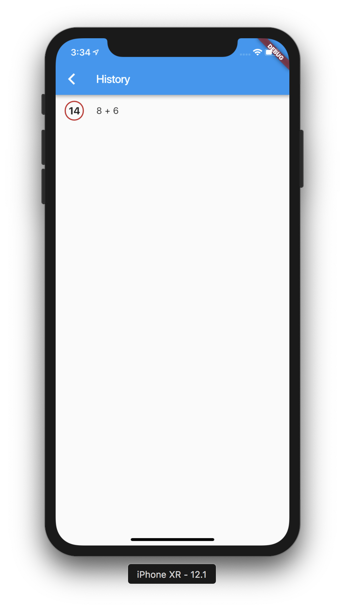

# Calculator App built with Flutter

This is a calculator test application built using Flutter.
As a test of the framework, I wanted to implement something simple that would help me get the basics down.

## Running the app
Follow the steps below to run the app on your local machine.
You'll need to make sure you have flutter installed and either Android Studio and XCode installed to test this application in a simulator.
Let me know if you encounter issues with the calculator

1. Make sure to have `flutter` installed on your machine
2. Clone the repo to your local machine
3. Open an emulator and run `flutter run` within the cloned repo's folder.
4. Try it out.

| Calculator Screen | History Screen |
| --- | --- |
|  |  |

